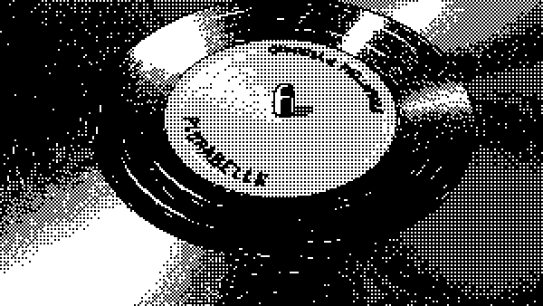

  

  

D E V &nbsp; B A C K - E N D &nbsp; — &nbsp; L O N D R I N A &nbsp; / &nbsp; P R

  

 

<h3 align="center"> 𝐒 𝐎 𝐁 𝐑 𝐄 &nbsp; 𝐌 𝐈 𝐌</h3>

<table align="center">
<tr>

<td width="60%">

Sou um entusiasta da tecnologia e estudante de Engenharia de Software na <strong>Unicesumar, Londrina | PR</strong>. Minha jornada no desenvolvimento é guiada pela busca de soluções back-end que unam performance, segurança e elegância.

Meu foco está na construção de sistemas escaláveis, APIs robustas e integrações eficientes. Trabalho com <strong>Python</strong>, utilizando frameworks como <strong>Flask</strong> e <strong>Django</strong>, e estou sempre explorando novas maneiras de otimizar bancos de dados e arquiteturas de servidor.

Utilizo o <strong>Visual Studio Code</strong> e o <strong>PyCharm</strong> como minhas principais ferramentas de desenvolvimento, combinando produtividade e conforto no dia a dia. Além do código, tenho um olhar atento para o design de software e a experiência do desenvolvedor, buscando criar não apenas código funcional, mas também legível e bem estruturado.

Fora do editor, mergulho em filosofia — especialmente Nietzsche — e encontro energia no peso do metal extremo. Slaughter to Prevail, death metal e deathcore fazem parte da minha trilha sonora diária. É desse caos controlado que tiro inspiração para criar ordem, lógica e intensidade nos meus projetos.

Acredito que a tecnologia, como uma boa distorção, amplifica o que somos. Cada commit é um passo em direção ao domínio da própria existência.

Sinta-se à vontade para explorar meus projetos e acompanhar minha evolução. Feedbacks e colaborações são sempre bem-vindos.

</td>

<td width="40%" align="center">

</td>

</tr>
</table>

<h3 align="center">
  𝐓 𝐄 𝐂 𝐍 𝐎 𝐋 𝐎 𝐆 𝐈 𝐀 𝐒 &nbsp; 𝐐 𝐔 𝐄 &nbsp; 𝐄 𝐒 𝐓 𝐎 𝐔 &nbsp; 𝐀 𝐏 𝐑 𝐄 𝐍 𝐃 𝐄 𝐍 𝐃 𝐎
</h3>

  
  
  
  

  
  
  
  
  
  
  

  
  

 

<!-- Contatos -->

  
  
  

 

*"Become who you are."*

  

  B A C K - E N D &nbsp; D E V E L O P E R

<td width="40%" align="center" style="border: none;">
  
</td>

  `MATHEUS ROVER · DEV BACK-END · LONDRINA`

